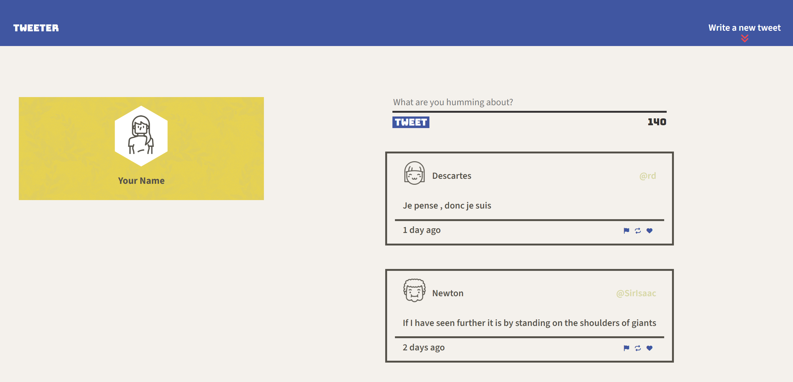

# Tweeter

Tweeter is a simple, single-page Twitter clone built as part of the Lighthouse Labs web bootcamp projects. This project focuses on developing front-end development skills using HTML, CSS, JavaScript, jQuery, and AJAX.

## Project Description

Tweeter allows users to compose and submit tweets. Tweets are dynamically rendered on the page without requiring a refresh. The application includes features such as character count validation, error messaging, and responsive design.

## Screenshots

### Desktop View


### Mobile View


## Prerequisites

Make sure you have the following installed:

- [Node.js](https://nodejs.org/) (version 14.x or higher)
- [npm](https://www.npmjs.com/) (version 6.x or higher)

## Installation

1. Clone the repository:
   ```bash
   git clone https://github.com/Somtico/tweeter
   ```
2. Navigate to the project directory:
   ```bash
   cd tweeter
   ```
3. Install the dependencies:
   ```bash
   npm install
   ```

## Running the Project

To start the server, run:
```bash
npm start
```

For development, use:
```bash
npm run local
```

The application will be available at `http://localhost:8080`.

## Project Structure

```
tweeter/
├── public/
│   ├── images/
│   ├── scripts/
│   ├── styles/
│   └── index.html
├── server/
│   ├── data-files/
│   ├── index.js
│   └── lib/
├── .gitignore
├── package.json
└── README.md
```

## Features

- **Responsive Design**: The layout adapts to different screen sizes, switching from a two-column layout to a one-column layout for smaller screens.
- **Dynamic Tweet Rendering**: Tweets are fetched and rendered dynamically using AJAX without requiring a page refresh.
- **Form Validation**: Provides real-time feedback on tweet length and displays appropriate error messages.
- **Character Counter**: Displays remaining character count and changes colour when the limit is exceeded.

## Dependencies

- `body-parser`: ^1.20.2
- `chance`: ^1.0.2
- `express`: ^4.19.2
- `md5`: ^2.1.0
- `nodemon` (devDependency): ^3.1.0

## Additional Information

- Ensure the server is running when testing the application.
- The form data is validated before submission to ensure tweet length requirements are met.
- Error messages are dynamically displayed and cleared based on form validation results.

## Contributing

Contributions are welcome! Please submit a pull request or open an issue to discuss any changes.

## License

This project is licensed under the ISC License.

## Acknowledgements

- [Lighthouse Labs](https://www.lighthouselabs.ca/) for providing the project framework and guidance.
- [jQuery](https://jquery.com/) for simplifying JavaScript.
- [Timeago.js](https://timeago.org/) for handling time formatting.

## Future Enhancements

- **User Authentication**: Implement user authentication to allow users to log in and have personalized profiles.
- **Direct Messaging**: Add functionality for users to send direct messages to each other.
- **Search Functionality**: Introduce a search feature to allow users to search for specific tweets or users.
- **Hashtags and Mentions**: Enable support for hashtags and mentions within tweets for better engagement and discoverability.
- **Image and Video Uploads**: Allow users to attach images or videos to their tweets.
- **Theme Customization**: Provide options for users to customize the theme and layout of their profile.
- **Analytics Dashboard**: Create a dashboard for users to view analytics about their tweets, such as engagement metrics and audience demographics.
